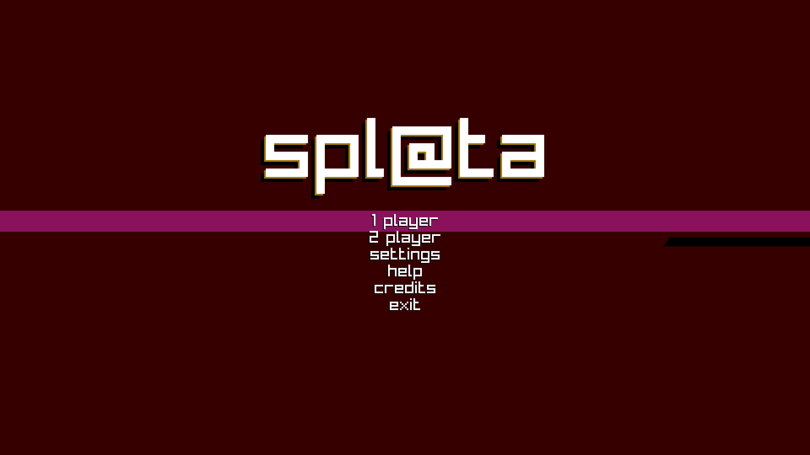
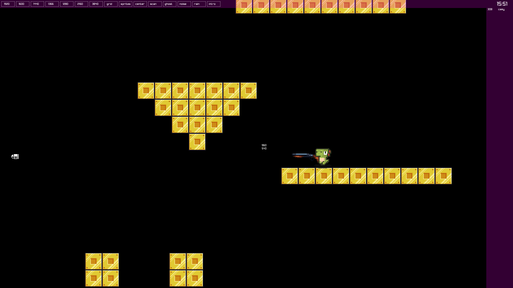

A layout for a simple platform game made using Go and Raylib. 
  
&bull;  Keypad - Movement 
&bull;  Left Control - Shoot 
&bull;  F1 - Hide/Show Dev Tools  

  

  

  

<iframe src='https://www.youtube.com/embed/TW0avdgwS48' frameborder='0' allowfullscreen></iframe>

  
